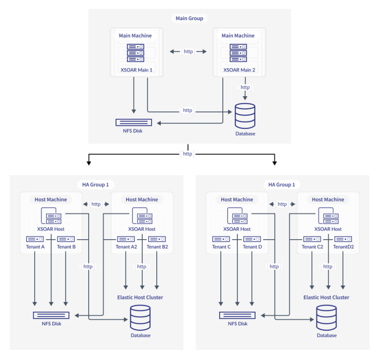

# XSOAR Multitenancy HA deployment with Terraform

### Overview
This Terraform pack support the deployment of XSOAR Multi-tenancy High availability in AWS. 

### Architecture
The deployment follow the recommended architecture by Palo Alto Networks https://docs-cortex.paloaltonetworks.com/r/Cortex-XSOAR/6.12/Cortex-XSOAR-Multi-Tenant-Guide/Multi-Tenant-High-Availability-Overview


This IaC pack will deploy everything in a single VPC:
- 3 Main XSOAR application servers in 3 AZs
- 3 Host XSOAR servers in 3 AZs. These 3 hosts are belong to the same host HA group.
- 1 OpenSearch cluster with 3 master nodes and 3 data nodes
- 2 EFS mount
- 1 Network Load Balancer for XSOAR main application servers

### Note for XSOAR Host installation
This deployment will only install the application on XSOAR main servers. After accessing XSOAR main servers web UI, you need to activate license, generate Host installer, copy to the Host servers then run the installation script in each Host server manually (or via any other automation/provisioning tools like Ansible).
After the Terraform deployment is completed, the script will provide output to ***xsoar_host_installation_script.sh*** file that you can use to install Host server.

### Execution
#### Prepare your VPC and AWS access
- Make sure your VPC has 3 public subnets in 3 AZs
- Make sure your computer has the correct aws credential to connect to your desired AWS environment, similar to using aws cli
#### Clone this repo
Clone this repo to your computer
#### Update the required parameter in the var.tf file
Edit the ***var.tf*** file to provide the required data for the deployment such as VPC ID, 3 Subnet ID, and some initial information for OpenSearch, system prefix...etc.
#### Run terraform
```
terraform init
terraform plan
terraform apply
```
#### Provision the Main server
- Access any XSOAR Main server via by its EIP.
- Upload license
- Change the external hostname to the AWS load balancer domain
- Create HA host group
- Generate host installer

#### Install XSOAR on the Host servers
- Copy the host installer to each Host servers
- Copy the ***xsoar_host_installation_script.sh*** to each Host servers 
- Switch to root
- Run `chmod +x xsoar_host_installation_script.sh`
- Run `./xsoar_host_installation_script.sh <path-to-host-installer-file name>` (e.g. ./xsoar_host_installation_script.sh /home/test/demistohost_1234.sh)

### Done. If there is any issue, please comment to this repo or message me

